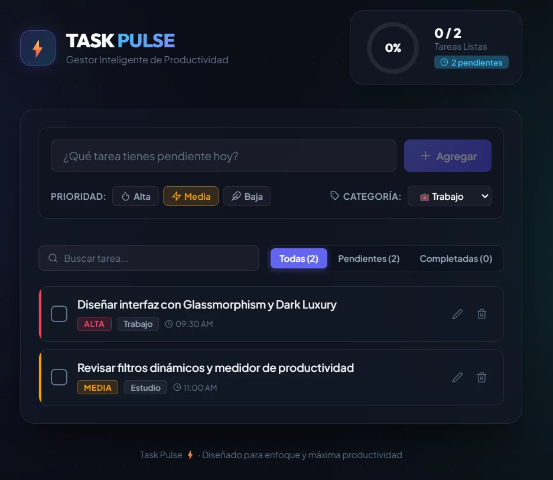

# ⚡ TASK PULSE

  

  
  
  
  
  

---

## ✨ Características Principales

* 🎨 **Cyber Glassmorphism:** Fondo ambiental de nebulosa con destellos flotantes, cristal translúcido y estética dark moderna.
* 📊 **Anillo de Productividad en Vivo:** Medidor circular que calcula en tiempo real el porcentaje y total de tareas completadas.
* 🔥 **Prioridades y Categorías:** Clasificación por niveles (*Alta 🔥*, *Media ⚡*, *Baja 🍃*) y etiquetas temáticas (*Trabajo*, *Personal*, *Estudio*, *Proyecto*, *Hogar*).
* ✏️ **Edición en Línea:** Modificación directa con atajos de teclado (`Enter` para guardar, `Escape` para cancelar).
* 🔍 **Filtros Dinámicos & Buscador:** Alterna entre *Todas*, *Pendientes* y *Completadas* con búsqueda instantánea.
* 💾 **Persistencia Automática:** Almacenamiento local en `localStorage` que conserva tus tareas para siempre.

---

## 🌐 Enlace de la Aplicación en Vivo

Haz clic en el enlace para abrir la aplicación desplegada en la nube:

👉 **[https://frankusqabant.github.io/Aplicaci-n-React-Tareas/](https://frankusqabant.github.io/Aplicaci-n-React-Tareas/)**
